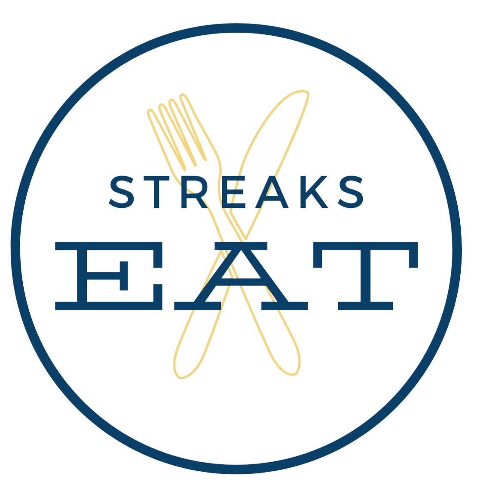

#Welcome to Streaks Eat!
#A John Carroll University App Developed by Abedelhadi Tawil, Jon Siudowski, Alyssa Augustein, and Gavin Weiser.
##
## In this capstone project, a mobile app has been developed to resolve the food waste issue across John Carroll University (JCU) campus. The idea has been started when Ayşe Selen Zarrelli, the director of Center for Student Diversity and Inclusion at JCU met with Dr. Almabrok Essa, CS professor and intructor for CS 4700, and discussed the possibility of developing an app to encourage community-centric redistribution of surplus food after events on JCU campus, which is aligned with the campus mission and sustainability goals. Finally, after a semester-long endeavor of the above mentioned developers team this idea has become a reality.

